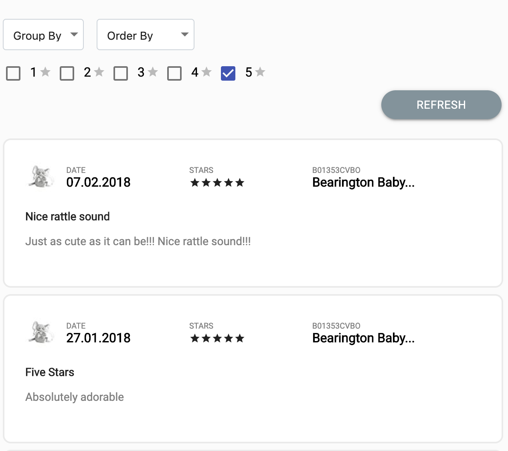

# InfiniteScrollReview (React, Redux)


TO-DO 
Service Integration with Redux (saga)
convert time stamp to iso format
Group By
Order By
Filter By Rating
Infinite scrolling
Designing, 
JS docs,
test cases and prop types
Read me
Refresh functionality
re factor code 

## Summary

1. Reviews can be grouped by day, week, or month. Make sure you show the time interval for
which reviews are shown (i.e. “05.02”, “05.02 - 11.02” or “January”)
2. Reviews can be filtered by number of stars. The default state should show 5 star reviews only.
3. Reviews should be sortable by time. Users should be able to toggle between showing most
recent reviews first, or last.
4. Infinite scrolling. As you scroll, more reviews will be loaded.


##### Custome Middleware
Created the custome middleware to handle the all API requests in the application with common action, instead of creating different API calls in action creators.
 
- This will allow us to handle loading spinner/loader globally across the application when handling with diffrent API calls.
- Action creators can be easily tested as all async calls will be handled in custom middleware.
- Code in the action creator is clean and uniform.
- When application is becoming bigger, we can handle all API calls across the application easily with clean code.

### Sample screens



### Get it running
Below are the steps to get it running.

 - Install all the dependences in the application by using the command ``` npm install ```
 - Then start the application in another terminal by using command ``` npm start ```
 - Run the tests using command ``` npm test ```
